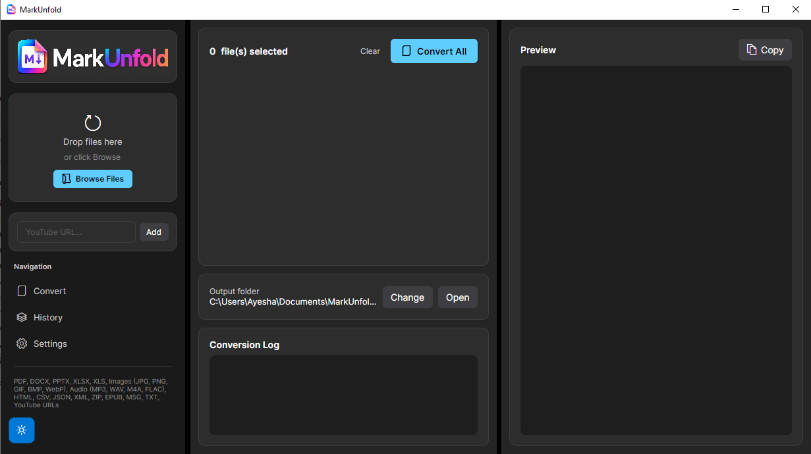
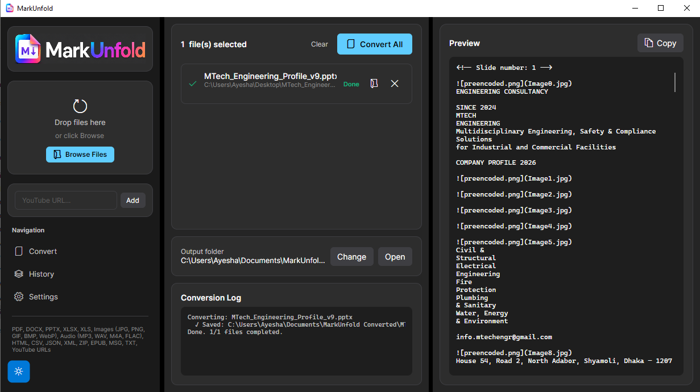
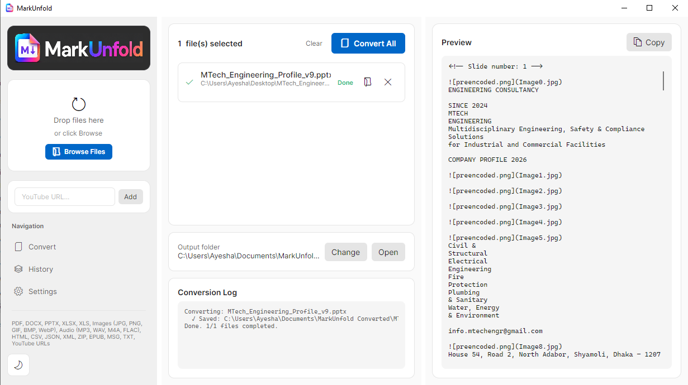

# MarkUnfold GUI

A modern desktop application for converting documents to Markdown using [MarkItDown](https://github.com/microsoft/markitdown) by Microsoft.

**MarkUnfold** provides a graphical interface to the powerful MarkItDown library, making it easy to convert PDFs, Word documents, PowerPoint presentations, Excel files, images, audio files, YouTube URLs, and more into clean Markdown.


## Screenshots





## Installation

Download the latest release from the [Releases page](https://github.com/muhammad-bot3392/MarkUnfold/releases).

### Option 1: Installer (Recommended)

1. Run `MarkUnfold-Setup-v1.0.0.exe`
2. Follow the setup wizard
3. Launch from Start Menu or Desktop shortcut

### Option 2: Portable

1. Extract `MarkUnfold-v1.0.0-win-x64.zip` to any folder
2. Run `MarkUnfold.exe`

No installation, no Python setup, no internet required.

## Usage

1. **Add files** — Use the "Browse Files" button or drag files onto the drop zone
2. **Add YouTube URLs** — Paste a YouTube URL and click "Add"
3. **Set output folder** — Click "Change" to select your output directory
4. **Convert** — Click "Convert All" and watch the progress
5. **Preview** — Click any completed file to preview its Markdown content
6. **Open** — Click the folder icon to open the output folder, or the file icon to open the file directly

## Supported Formats

| Category | Formats |
|----------|---------|
| Documents | PDF, DOCX, PPTX, XLS, XLSX |
| Images | JPG, JPEG, PNG, GIF, BMP, WebP |
| Audio | MP3, WAV, M4A, FLAC |
| Text/Web | HTML, CSV, JSON, XML |
| Archives | ZIP |
| E-books | EPUB |
| Email | MSG |
| Misc | TXT, MD |
| Web | YouTube URLs |

## Offline Operation

MarkUnfold is designed to work completely offline. The release package includes:

- `MarkUnfold.exe` — Self-contained .NET 9.0 application (no .NET runtime installation required)
- `python/` — Portable Python 3.11 runtime (Windows embeddable distribution)
- `python/Lib/site-packages/` — Pre-installed `markitdown[all]` and all dependencies
- `markitdown_bridge.py` — Python bridge script

No internet connection is required at any point. All document conversion happens locally using the bundled Python runtime.

## Architecture

```
┌─────────────────────────────────────────────────────────────┐
│                    MarkUnfold GUI (Avalonia .NET)            │
│  ┌──────────────┐  ┌─────────────┐  ┌──────────────────┐   │
│  │ ViewModels   │  │   Views     │  │   Services       │   │
│  │ (MVVM)       │◄─│  (.axaml)   │  │ (Logic Layer)    │   │
│  └──────────────┘  └─────────────┘  └────────┬─────────┘   │
└──────────────────────────────────────────────┼─────────────┘
                                               │
                                               ▼
┌─────────────────────────────────────────────────────────────┐
│              markitdown_bridge.py (Python Subprocess)       │
│  ┌─────────────────────────────────────────────────────────┐│
│  │                    MarkItDown Library                   ││
│  │   (PDF, Word, Excel, PowerPoint, Audio, Images, etc.)  ││
│  └─────────────────────────────────────────────────────────┘│
└─────────────────────────────────────────────────────────────┘
```

The GUI communicates with the Python `markitdown` library via a bridge script (`markitdown_bridge.py`) running as a subprocess. This architecture provides:

- **Structured I/O** — JSON-based request/response protocol
- **Per-file error isolation** — One process per file; crashes don't affect the batch
- **No intermediate temp files** — Markdown content is returned directly via JSON

## Configuration

Settings are stored in `%APPDATA%\MarkUnfold\prefs.json`:

- Theme (dark/light)
- Output folder
- Azure Document Intelligence settings
- Azure Content Understanding settings
- Conversion history

## Building from Source

See [BUILD.md](BUILD.md) for detailed build instructions.

Quick start:
```bash
git clone https://github.com/muhammad-bot3392/MarkUnfold.git
cd MarkUnfold/MarkItDownGUI
dotnet run --project MarkItDownGUI.csproj
```

## License

This project is a derivative work based on [MarkItDown](https://github.com/microsoft/markitdown) by Microsoft Corporation.

- **MarkItDown**: MIT License © Microsoft Corporation
- **MarkUnfold GUI**: MIT License — see [LICENSE-MARKITDOWNGUI.md](LICENSE-MARKITDOWNGUI.md)

## Acknowledgements

- [MarkItDown](https://github.com/microsoft/markitdown) — Microsoft's document-to-markdown converter
- [Avalonia UI](https://avaloniaui.net/) — Cross-platform XAML framework
- [CommunityToolkit.Mvvm](https://learn.microsoft.com/en-us/dotnet/communitytoolkit/mvvm/) — MVVM helpers

## Support

For issues specific to this GUI, please use [GitHub Issues](https://github.com/muhammad-bot3392/MarkUnfold/issues).

For MarkItDown library issues, visit the [upstream repository](https://github.com/microsoft/markitdown/issues).
